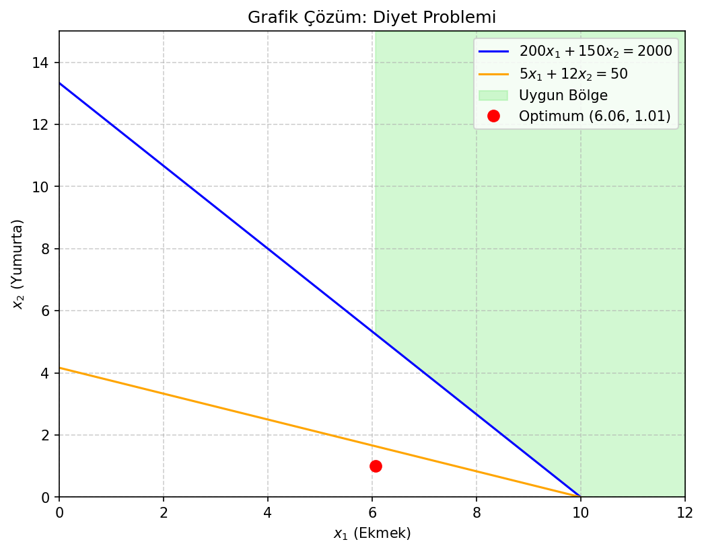
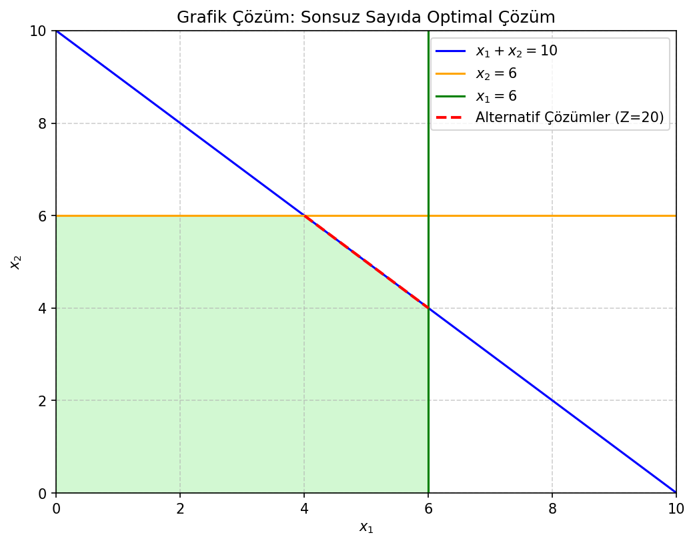

# 📊 Grafik Çözüm Yöntemi

Grafik çözüm, **iki karar değişkenli** doğrusal programlama problemlerini **geometrik olarak** çözmek için kullanılan sezgisel ve öğretici bir yöntemdir. Üç veya daha fazla değişkenli problemlerde görselleştirme mümkün olmadığı için bu yöntem yalnızca **eğitim ve anlama amacıyla** kullanılır.

> 📌 Tüm görseller, `matplotlib` kodlarıyla üretilmiştir.

---

## 🧠 Yöntem Adımları

1. **Kısıtları eşitsizlikten eşitliğe çevirerek doğruları çiz**  
2. **Her kısıtın uygun tarafını belirle** (deneme noktası: genelde (0,0))  
3. **Tüm kısıtların kesişimiyle uygun bölgeyi (feasible region) oluştur**  
4. **Amaç fonksiyonunu sabit bir değerle çiz (izoprofit/izocost doğrusu)**  
5. **Bu doğrusunu kaydırarak uygun bölge üzerinde en iyi değeri bul**  
6. **Optimum genellikle bir köşe noktasındadır**

> 🔑 Teorem: Eğer bir DP probleminin **küresel optimumu varsa**, o optimum **uygun bölgenin en az bir köşe noktasında** bulunur.

---

## 📚 Örnek 1: Üretim Karı Maksimizasyonu

**Problem**:  
Max: `Z = 40·x₁ + 30·x₂`  
s.t.:  
`2·x₁ + x₂ ≤ 100` &nbsp;&nbsp; (işçilik)  
`x₁ + 3·x₂ ≤ 90` &nbsp;&nbsp;&nbsp;&nbsp; (malzeme)  
`x₁, x₂ ≥ 0`

### Çözüm Özeti:
- Köşe noktaları: (0,0), (0,30), (50,0), **(42,16)**  
- Optimum: **(42, 16)** → `Z = 2160`

> ✅ Görselde:  
> - Mavi ve turuncu çizgiler: kısıt doğruları  
> - Yeşil alan: uygun bölge  
> - Kırmızı nokta: küresel optimum

---

## 📚 Örnek 2: Minimizasyon – Diyet Problemi

**Problem**:  
Min: `Z = 2·x₁ + 5·x₂`  
s.t.:  
`200·x₁ + 150·x₂ ≥ 2000` &nbsp;&nbsp; (kalori)  
`5·x₁ + 12·x₂ ≥ 50` &nbsp;&nbsp;&nbsp;&nbsp;&nbsp;&nbsp; (protein)  
`x₁, x₂ ≥ 0`

### Çözüm Özeti:
- Kesişim noktası: **(6.06, 1.01)**  
- Minimum maliyet: **≈17.17 ₺**

> ✅ Görselde:  
> - Kısıtların “≥” olması nedeniyle uygun bölge **üst tarafta**  
> - Optimum iki kısıtın kesişiminde

---

## 📚 Örnek 3: Sonsuz Sayıda Optimal Çözüm

**Problem**:  
Max: `Z = 2·x₁ + 2·x₂`  
s.t.:  
`x₁ + x₂ ≤ 10`  
`x₁ ≤ 6`  
`x₂ ≤ 6`  
`x₁, x₂ ≥ 0`

### Çözüm Özeti:
- Amaç doğrusu, `x₁ + x₂ = 10` ile **özeldeşir**  
- Tüm `(x₁, x₂)` çiftleri: `x₁ + x₂ = 10`, `4 ≤ x₁ ≤ 6` → **sonsuz çözüm**  
- Küresel optimum değeri: `Z = 20`

> ✅ Görselde:  
> - Kırmızı kesikli çizgi: amaç fonksiyonu (Z = 20)  
> - Kalın siyah çizgi: alternatif çözümlerin bulunduğu kenar

---

## 📌 Özet

- Grafik çözüm **yalnızca 2 değişkenli** DP’ler için uygundur  
- Uygun bölge her zaman **konveks çokgen**  
- Optimum **mutlaka bir köşededir** (ya da kenar üzerinde sonsuz çözüm)  
- Hem maksimizasyon hem minimizasyon için geçerlidir

---

## ➡️ Sonraki Adım

Daha yüksek boyutlu problemler için cebirsel çözüm yöntemi:

→ [Simpleks Yöntemi](simplex-method.md)
